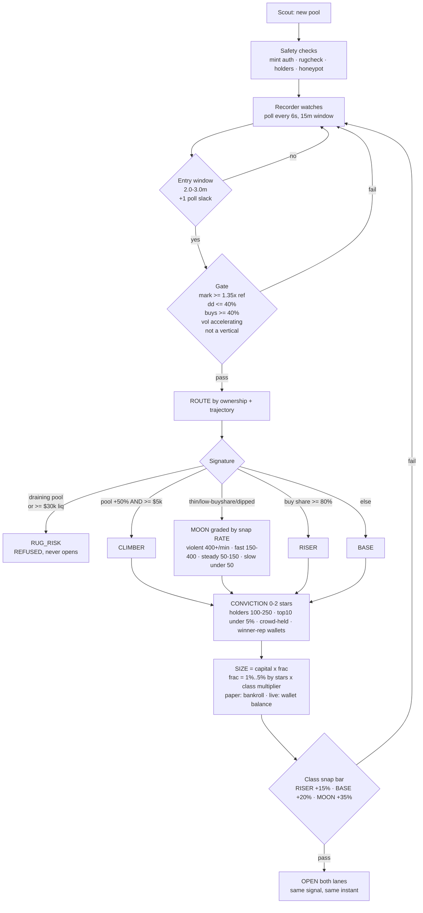
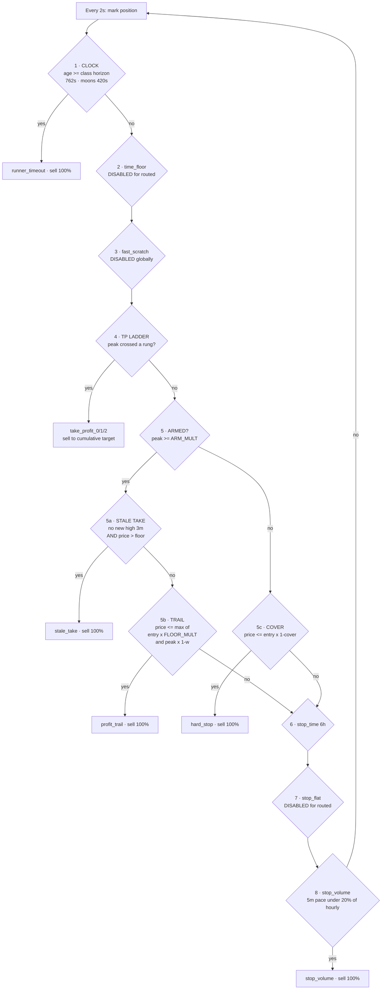
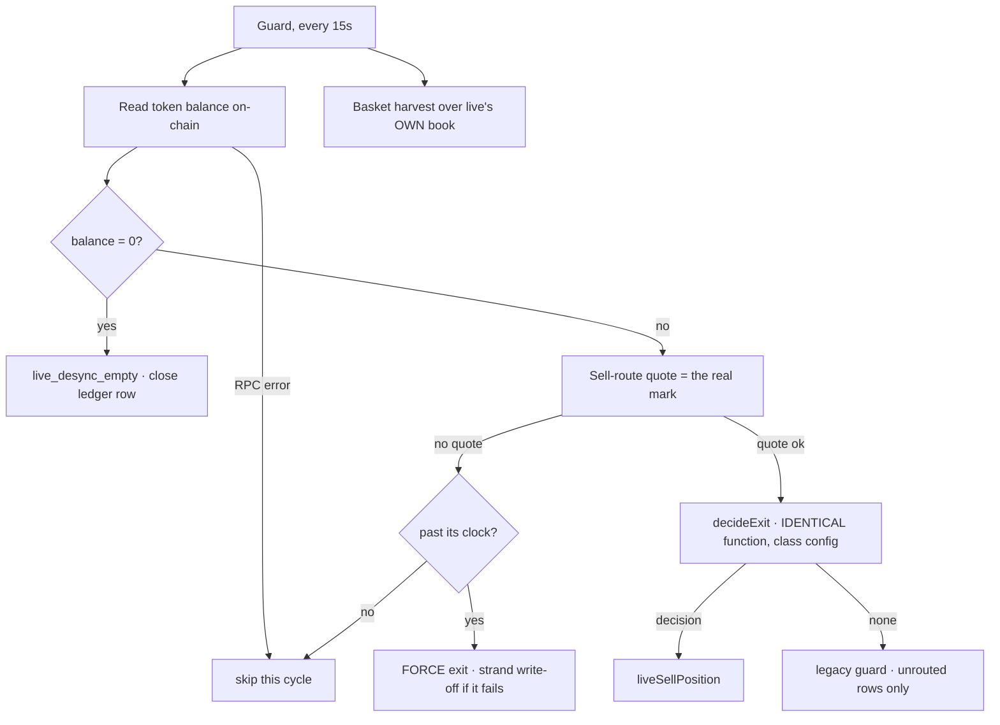

# Trade Management System — end to end

Read from the code on 2026-07-21, not from memory. Every exit below is a real
branch in `decideExit` (`services/trader/src/paper.ts`) or in the live guard
(`services/trader/src/live/executor.ts`). **Precedence is top-to-bottom and the
first match wins** — that ordering is where tonight's defects lived.

---

## 1. Entry

**Both lanes fire from the same point.** Live is called from inside
`openFromSignal` the moment paper's size is known, and receives paper's
**realised fraction of capital** so relative risk matches by construction.

---

## 2. Management — the exit ladder, in precedence order

Evaluated every **2 seconds** per open position. First match wins.

### The trail width — a ratchet that tightens as the move grows

| peak (entry-relative) | trail width | rationale |
| --- | --- | --- |
| below top rung | class trail (25–45%) | normal breathing |
| 3.2–8× | 40% | still developing, don't shake out |
| 8–20× | 28% | proven runner, start defending |
| 20×+ | 18% | rare gain, defend hard |

The floor itself always ratchets — it is `peak × (1 − w)` and peak only rises.

---

## 3. The precedence traps — where tonight's losses came from

**`ARMED` is a switch, not a threshold.** Once `peak >= ARM_MULT`, the class
**cover stops applying entirely** — branch 5c is the `else` of 5. From that
moment the only downside protection is `max(entry × FLOOR_MULT, trailFloor)`.
Setting `FLOOR_MULT` to the cover looked equivalent and is not: it let the trail
walk a green position to −30%.

**A percentage trail guarantees a loss below `1 ÷ (1 − w)`.** At w = 45% that
threshold is **1.82×**. Any position peaking under it and trailing out closes
red *by construction*. Audited: 12 `profit_trail` exits, avg peak 1.28×, avg
exit 0.66×, **−$15.47** — the largest loss pool in the book.

**`stale_take` outranks the trail** and is gated on `price > entry × FLOOR_MULT`.
With `FLOOR_MULT` at the cover, "take" could fire at 0.41× — a 59% loss labelled
as a profit-take.

**Disabling one knob can disable a mechanism sharing its branch.** Setting the
profit-lock arm to Infinity to remove the never-close-red ratchet also removed
**the entire trailing stop** — they live in the same `if (armed)` block. Result:
no trail at all, every exit fell through to the clock, runners gave back 68–78%.

---

## 4. Live lane — same genome, different execution

Live differs from paper in exactly three ways, all deliberate: it marks from a
**real sell-route quote** (better than a price feed), it carries **solvency
caps** paper has no need for (kill switch, daily loss cap), and its fills face
real slippage.

**The `no quote → skip` path was the worst bug of the session.** For a rugged
token the quote fails *every* cycle, so `decideExit` was never reached and the
position could not exit by any route — seven positions stranded 20–73 minutes
past their clocks and were written off by hand for $19.88.

---

## 5. Open items

- **The profit-lock restoration (arm 1.03 / floor 1.02) is written but NOT
  committed.** Until it ships, the trail can still exit a winner red.
- `stale_take` inherits `PROFIT_LOCK_FLOOR_MULT`; it is fixed by the same change
  but has never been audited on its own.
- `basket_harvest` and `stop_volume` are book-level rules that have never been
  measured per signature.
- The learning loop simulates **four** mechanisms (cover, trail, ladder, clock).
  Everything else on this page is unmodelled, so promotions are fitted to a
  simpler system than the one that runs.
